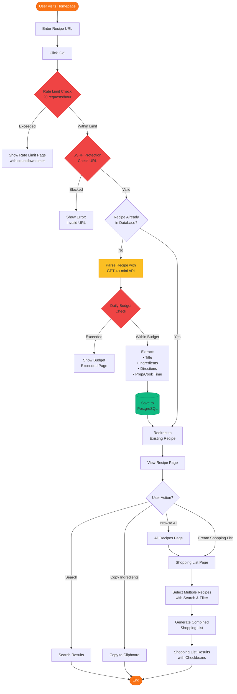

# Dish List

A lightweight recipe parser that extracts ingredients and directions from any recipe URL with built-in abuse protection and intelligent parsing.

## Overview

Dish List is a Flask-based web application that parses recipe URLs using OpenAI's GPT-4o-mini API and stores them in PostgreSQL. The app includes comprehensive abuse protection (rate limiting, SSRF protection, budget controls) and features for building shopping lists from multiple recipes.

## Key Features

### Recipe Management
- **Intelligent Parsing** - Uses GPT-4o-mini to extract clean recipe data from any URL
- **Duplicate Detection** - Automatically detects and redirects to existing recipes
- **PostgreSQL Storage** - Persistent storage with SQLAlchemy ORM and automated migrations
- **Full-Text Search** - Find recipes by title across your entire collection
- **Shopping Lists** - Combine multiple recipes into organized shopping lists with categories

### Security & Protection
- **Rate Limiting** - 20 requests per hour per IP address
- **SSRF Protection** - Blocks localhost and private IP addresses
- **Daily Budget Control** - $1/day API spending cap with tracking
- **Cost Monitoring** - Real-time API usage and cost tracking dashboard
- **IP Blocking** - Automatic blocking for abuse prevention

### User Experience
- **Mobile-First Design** - Responsive layout with 44px touch targets
- **Loading States** - Dynamic cooking messages during recipe parsing
- **Error Handling** - Graceful error pages for rate limits, budget exceeded, and blocked access
- **Modern UI** - Clean design with TailwindCSS v4 and OKLCH color space

## How It Works

1. **User Input** - User submits a recipe URL on the homepage
2. **Security Checks** - System validates against rate limits, SSRF, and existing duplicates
3. **AI Parsing** - GPT-4o-mini extracts title, ingredients, directions, and cooking times
4. **Database Storage** - Recipe is saved to PostgreSQL with full relational structure
5. **Display** - User views the parsed recipe with copy-to-clipboard functionality

## Tech Stack

### Backend
- **Flask** - Python web framework
- **SQLAlchemy** - ORM for database operations
- **Flask-Migrate** - Database migration management (Alembic)
- **psycopg** - PostgreSQL adapter
- **Gunicorn** - Production WSGI server

### Frontend
- **TailwindCSS v4** - Utility-first CSS framework
- **Jinja2** - Template engine
- **Vanilla JavaScript** - Progressive enhancement

### External Services
- **OpenAI GPT-4o-mini** - Recipe parsing ($0.00045 per request)
- **PostgreSQL** - Database (Supabase free tier: 500MB)
- **Render.com** - Web hosting (free tier with cold starts)

### Security
- **Rate Limiting** - Custom IP-based implementation
- **SSRF Protection** - URL validation against private networks
- **Budget Tracking** - API cost monitoring and limits

## Architecture

See how the application works end-to-end:



**[Full Architecture Documentation](docs/architecture.md)** - System diagrams, database schema, and security flows

## Documentation

**[Full Documentation](docs/)** - Detailed guides and references

- **[Getting Started](docs/getting-started.md)** - Complete setup guide
- **[Deployment Guide](docs/deployment.md)** - Deploy to Render + Supabase ($0/month)
- **[Architecture](docs/architecture.md)** - System flow, tech stack, database schema
- **[ORM & Migrations](docs/orm-migration.md)** - Database schema management
- **[Development Guide](docs/development.md)** - Contributing and workflows
- **[API Reference](docs/api-reference.md)** - Routes and models

### View Documentation Locally

```bash
# Install MkDocs
pip install mkdocs mkdocs-material

# Serve documentation at http://localhost:8000
mkdocs serve
```

## Database Schema

The application uses a relational database with the following models:

- **Recipe** - Core recipe metadata (title, source URL, timestamps, cooking times)
- **Ingredient** - Recipe ingredients (linked to recipes via foreign key)
- **Direction** - Step-by-step cooking instructions (ordered by step number)
- **GroceryList** - Shopping list items organized by category
- **RateLimit** - IP-based rate limiting tracking
- **APIUsage** - Daily API cost and token usage monitoring
- **BlockedIP** - IP blocking for abuse prevention

See [docs/architecture.md](docs/architecture.md) for detailed schema diagrams.

## Project Structure

```
ez-recipe/
├── application.py              # Entry point (loads .env)
├── recipe_parser.py            # Flask app, routes, parsing logic
├── models.py                   # SQLAlchemy ORM models (7 models)
├── requirements.txt            # Python dependencies
├── package.json                # Node.js dependencies (TailwindCSS)
├── migrations/                 # Database migrations (Alembic)
│   └── versions/               # Migration files
├── templates/                  # Jinja2 HTML templates
│   ├── index.html             # Homepage with URL input
│   ├── recipe.html            # Recipe detail view
│   ├── recipes.html           # Recipe list with search
│   ├── shopping-list.html     # Multi-recipe shopping list
│   └── [error pages]          # Rate limit, budget, blocked
├── static/                     # Static assets
│   ├── globals.css            # TailwindCSS source
│   └── output.css             # Compiled CSS (generated)
└── docs/                       # Documentation
    ├── architecture.md        # System diagrams and flows
    ├── getting-started.md     # Setup instructions
    ├── deployment.md          # Render + Supabase deployment
    ├── security.md            # Security features
    └── [additional docs]
```

## Cost Breakdown

- **Hosting** - $0/month (Render free tier)
- **Database** - $0/month (Supabase free tier, 500MB)
- **API Costs** - ~$0.00045 per recipe parse
- **Daily Budget Cap** - $1/day (safety limit for ~2,200 requests)
- **Monthly Cost** - <$7/month at full capacity (480 recipes/day)

## Contributing

Contributions welcome! Please see the [Development Guide](docs/development.md) for setup instructions.

## License

MIT License - feel free to use this project however you'd like!

---

**Need help?** Check out the [documentation](docs/) or open an issue.
