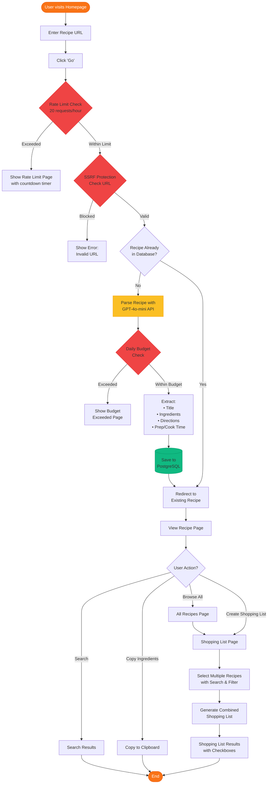
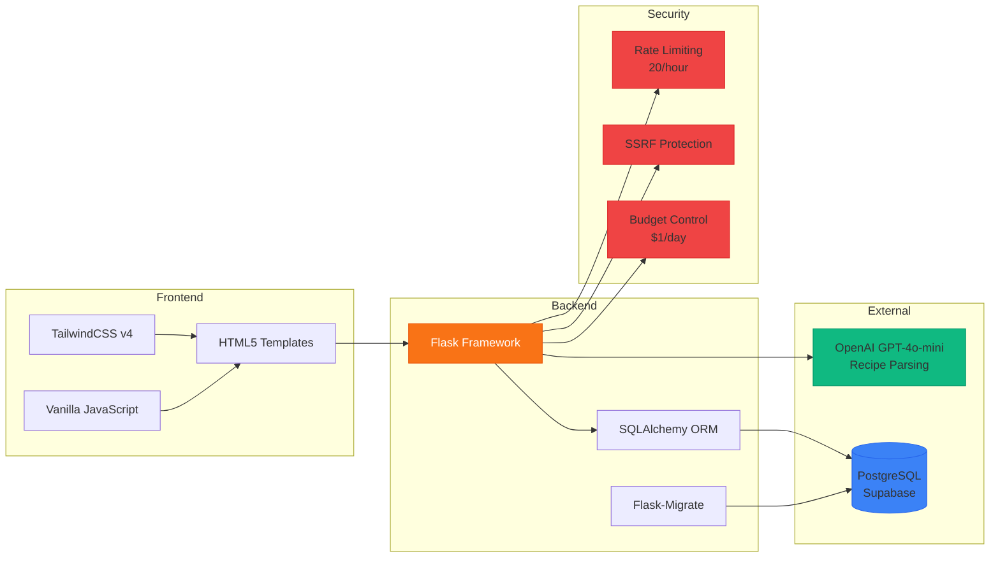
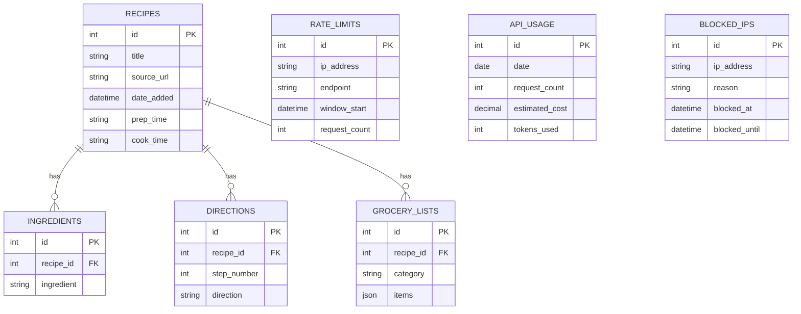
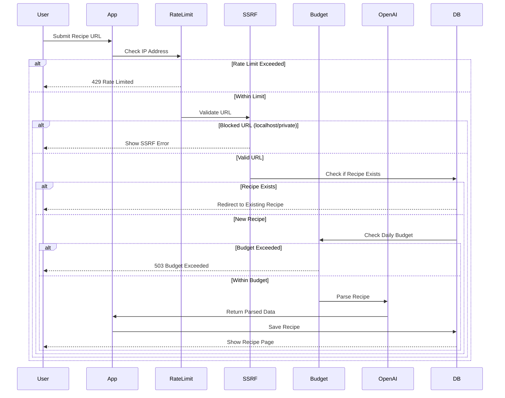
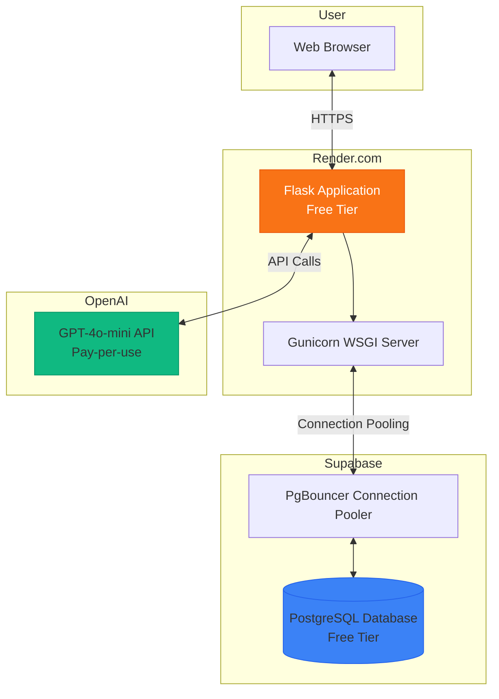

# Application Architecture

## System Flow Diagram

## Technology Stack

## Database Schema

## Security & Protection Flow

## Key Features

### 1. Recipe Parsing
- Extracts clean recipe data from any URL
- Uses GPT-4o-mini for intelligent parsing
- Automatic duplicate detection

### 2. Abuse Protection
- **Rate Limiting**: 20 requests/hour per IP
- **SSRF Protection**: Blocks localhost and private IPs
- **Budget Control**: $1/day API spending cap
- **Cost Tracking**: ~$0.00045 per request

### 3. Multi-Recipe Shopping Lists
- Select multiple recipes with search/filter
- Combined ingredient list
- Interactive checkboxes for shopping

### 4. Mobile-First Design
- Responsive on all screen sizes
- 44px touch targets for mobile
- Progressive enhancement

## Deployment Architecture

## Cost Breakdown

- **Hosting**: $0/month (Render free tier)
- **Database**: $0/month (Supabase free tier)
- **API Costs**: ~$0.22/day at full capacity (480 requests)
- **Safety Buffer**: $1/day budget cap (4.5x safety margin)

**Total Monthly Cost**: < $7/month for full usage
